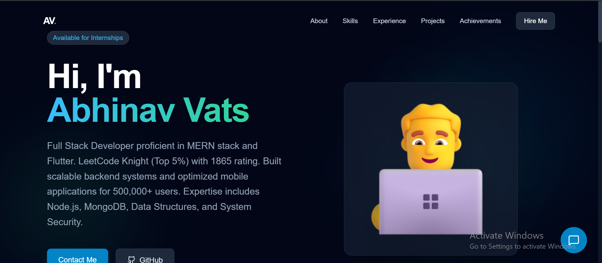

# 👨‍💻 Abhinav Vats - Personal Portfolio

 
> A high-performance, responsive personal portfolio website built to showcase my Full Stack development projects and competitive programming achievements.

## 🚀 **Live Demo**
👉 **[View Portfolio Live](https://abhinav-vats-portfolio.vercel.app/)**

---

## 🛠️ **Tech Stack**
- **Frontend:** React.js, Tailwind CSS
- **Build Tool:** Vite (for ultra-fast performance)
- **Animations:** Framer Motion / CSS3
- **Deployment:** Vercel

## ✨ **Features**
- **Dark Mode / Cyberpunk Theme:** Designed for a modern, developer-centric look.
- **Fully Responsive:** Optimized for Mobile, Tablet, and Desktop.
- **Project Showcase:** Highlights my work in MERN Stack and Flutter.
- **Live Coding Stats:** Direct links to my LeetCode (Knight) and Codeforces profiles.
- **Contact Integration:** Simple, direct access to my socials.

## 📦 **Installation & Setup**
If you want to run this project locally:

1. **Clone the repository:**
  https://github.com/Abhinav771/Abhinav_Vats_Portfolio.git

2. **Navigate to the project directory:**
   ```cd Abhinav_Vats_Portfolio```

3. **Install dependencies:**
   ```npm install```

4. **Start the development server:**
   ```npm run dev```

## 📬 **Contact Me**
- **LinkedIn:** [Abhinav Vats](https://www.linkedin.com/in/abhinav-vats-8033b127a/)
- **GitHub:** [Abhinav771](https://github.com/Abhinav771)
- **Email:** [abhinavvats771@gmail.com](mailto:abhinavvats771@gmail.com)